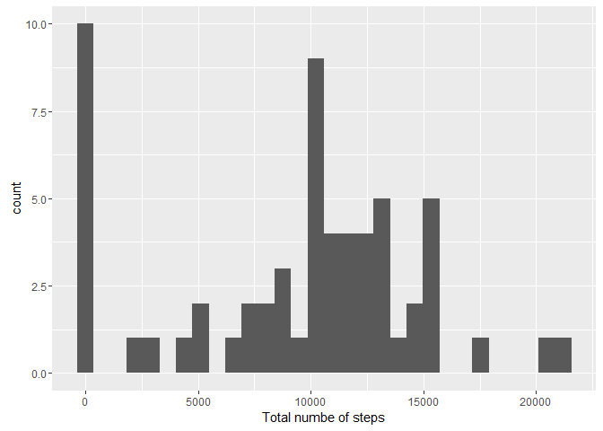
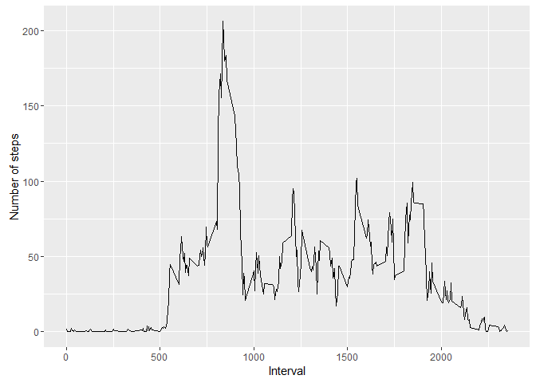
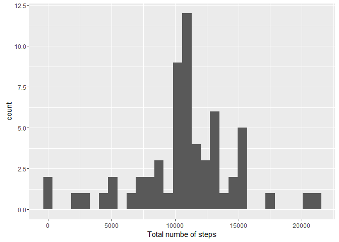
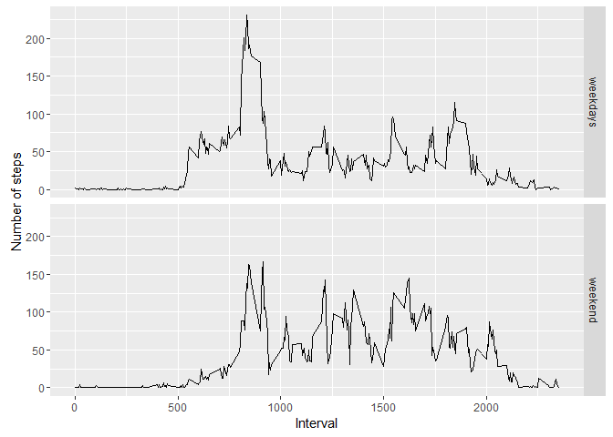

# Reproducible Research: Peer Assessment 1


## Loading and preprocessing the data

```r
library(lubridate)
```

```
## 
## Attaching package: 'lubridate'
```

```
## The following object is masked from 'package:base':
## 
##     date
```

```r
if(!exists("activiy.csv")){
        unzip("activity.zip")
}
data <- read.csv("activity.csv")
data$date <- ymd(data$date)
```

## What is mean total number of steps taken per day?
1. Make a histogram of the total number of steps taken each day

```r
library(dplyr)
```

```
## 
## Attaching package: 'dplyr'
```

```
## The following objects are masked from 'package:lubridate':
## 
##     intersect, setdiff, union
```

```
## The following objects are masked from 'package:stats':
## 
##     filter, lag
```

```
## The following objects are masked from 'package:base':
## 
##     intersect, setdiff, setequal, union
```

```r
library(ggplot2)
TotalNumber <- data %>% group_by(date) %>%
        summarize(Total_number = sum(steps, na.rm = T))
qplot(x = Total_number, data = TotalNumber, xlab = "Total numbe of steps")
```

```
## `stat_bin()` using `bins = 30`. Pick better value with `binwidth`.
```

<!-- -->

2. Calculate the mean and median

```r
mean <- mean(TotalNumber$Total_number)
median <- median(TotalNumber$Total_number)
```
Mean is 9354.2295082, median is 10395

## What is the average daily activity pattern?
1. Make a time series plot (i.e. type = "l") of the 5-minute interval (x-axis) and the average number of steps taken, averaged across all days (y-axis)

```r
data1 <- data %>% group_by(interval) %>%
        summarize(average = mean(steps, na.rm = T))
qplot(y = average, x = interval, data = data1, geom = "line",
      xlab = "Interval", ylab = "Number of steps")
```

<!-- -->

2. Which 5-minute interval, on average across all the days in the dataset, contains the maximum number of steps?

```r
max <- data1$interval[data1$average == max(data1$average)]
```

Interval 835-840 contains the maximum number of steps on average.

## Imputing missing values
1. Calculate and report the total number of missing values in the dataset (i.e. the total number of rows with NAs)

```r
missing <- nrow(data) - nrow(na.omit(data))
```
There're 2304 rows have NAs

2. Devise a strategy for filling in all of the missing values in the dataset. 

I choose the strategy which is to use the mean for that day to fill the missing values.

3. Create a new dataset that is equal to the original dataset but with the missing data filled in.

```r
dataNew <- data %>% group_by(interval) %>%
        mutate(steps = ifelse(is.na(steps), mean(steps, na.rm = T), steps))
```

4. Make a histogram of the total number of steps taken each day and Calculate and report the mean and median total number of steps taken per day. Do these values differ from the estimates from the first part of the assignment? What is the impact of imputing missing data on the estimates of the total daily number of steps?

```r
TotalNumberNew <- dataNew %>% group_by(date) %>%
        summarize(Total_number = sum(steps, na.rm = T))
qplot(x = Total_number, data = TotalNumberNew, xlab = "Total numbe of steps")
```

```
## `stat_bin()` using `bins = 30`. Pick better value with `binwidth`.
```

<!-- -->

```r
meanNew <- mean(TotalNumberNew$Total_number)
medianNew <- median(TotalNumberNew$Total_number)
```
New mean is 1.0766189\times 10^{4}, new median is 1.0766189\times 10^{4}. 

Both mean and median increase.

Imputing the missing data will increase the estimates of daily number of steps, because I choose the strategy which is using the mean of that 5 interval to replace the NA, so some value changes from 0 to a positve number which rise the estimation of the data.

## Are there differences in activity patterns between weekdays and weekends?
1. Create a new factor variable in the dataset with two levels – “weekday” and “weekend” indicating whether a given date is a weekday or weekend day.

```r
dataNew <- dataNew %>%
        mutate(weekend = ifelse(wday(date) %in% c(1, 7), "weekend", "weekdays")) %>%
        mutate(weekend = as.factor(weekend))
```

2. Make a panel plot containing a time series plot (i.e. type = "l") of the 5-minute interval (x-axis) and the average number of steps taken, averaged across all weekday days or weekend days (y-axis). See the README file in the GitHub repository to see an example of what this plot should look like using simulated data.

```r
data2 <- dataNew %>%
        group_by(weekend, interval) %>%
        summarize(average = mean(steps))
qplot(y = average, x = interval, data = data2, facets = weekend ~., geom = "line",
      xlab = "Interval", ylab = "Number of steps")
```

<!-- -->
